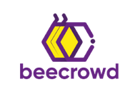

 # Beecrowd

  

 #### <b> :warning: Atenção - A URI online judge agora é chamada de Beecrowd.</b> :warning:
 
Este repositório foi criado com a intenção de divulgar as soluções feitas na plataforma <i>Beecrowd</i> com o intuito de melhorar minhas <i>skills</i> em cada linguagem.
 
 

  - Objetivos deste repositório [leia esse arquivo](https://github.com/jocelinoFG017/URI-online-judge-solutions/blame/master/Objetivos.md)
  - README English version [here](https://github.com/jocelinoFG017/URI-online-judge-solutions/blame/master/ReadmeENGLISH.md)

## Linguagens Utilizadas 
    - C
    - Java
    - Python
    - SQL

##  Meu Perfil na Beecrowd
Link do Perfil -> https://www.beecrowd.com.br/judge/pt/profile/279941
 
 

## Meu Ranking na Beecrowd
  
 - :2nd_place_medal:  2º Lugar no rank institucional IFFAR -> Instituto Federal Farroupilha

 - 13.316º Lugar no rank geral da plataforma.

  <h2>Quer contribuir com este repositório? </h2>
  
  Veja este documento [aqui](https://github.com/jocelinoFG017/URI-online-judge-solutions/blame/master/CONTRIBUTING.md) para saber como.